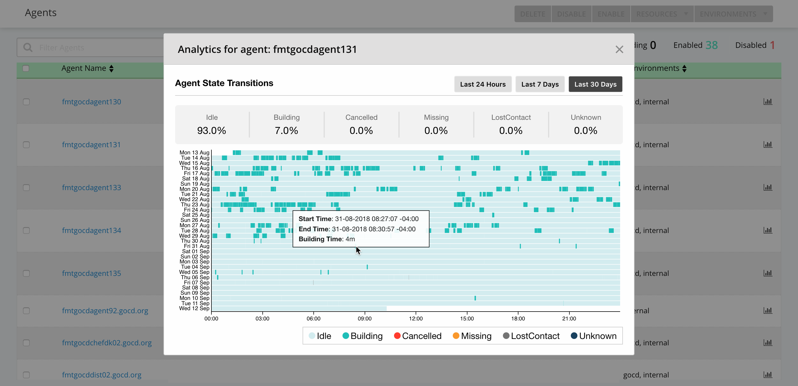

# GoCD Analytics Plugin

## Agent Analytics

Agent analytics provides insights into agent activity. It provides information about the states that an agent spent time in. It also shows aggregate times spent in different states. This could help make decisions about the possibility of bringing down agents when not in use, or using GoCD's elastic agents.

