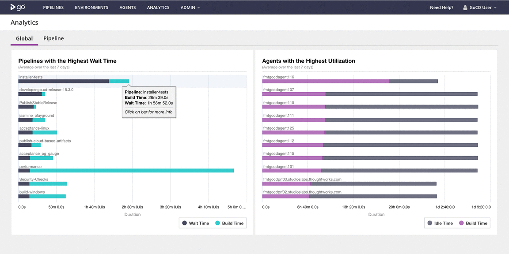

# GoCD Analytics Plugin

## Global Analytics:

GoCD super administrators can see global analytics, across pipelines. This [short video](images/2018_04_Analytics_TopLevel_Small.mp4) shows this capability.

Global analytics consists of three parts:

### Pipelines with highest wait time, averaged over the last 7 days.

1. From there, you can drill down to the jobs in a chosen pipeline, with the highest wait time, averaged over 7 days.

2. From there, you can drill down to the individual job instances to see their build and wait times.

Clicking on a chosen instance here takes you to the Job Details page in GoCD.

### Agents with the highest utilization, averaged over the last 7 days.

1. From there, you can drill down to the jobs with the highest wait time on *that* agent.

2. From there, you can drill down to the individual job instances of a chosen job to see their build and wait times.

Clicking on a chosen instance here takes you to the Job Details page in GoCD.

### Pipeline analytics

The pipeline-level analytics mentioned earlier are also available at the global level.

[Global Analytics (click to see a short video)](images/2018_04_Analytics_TopLevel_Small.mp4)
