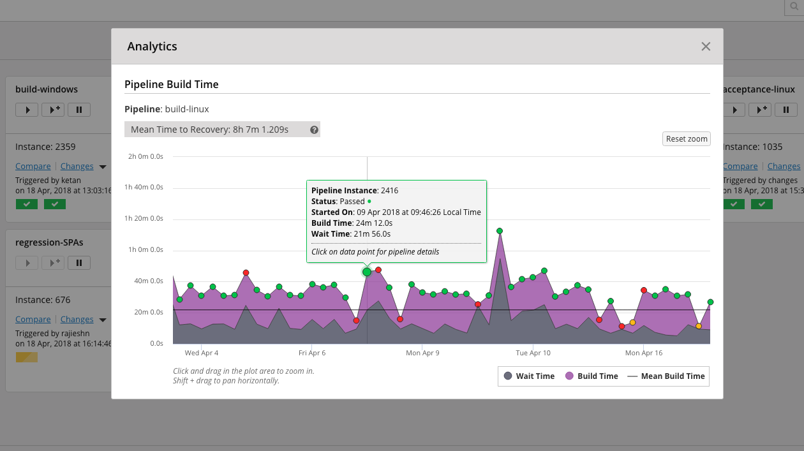

# GoCD Analytics Plugin

## Pipeline Analytics

Pipeline analytics provides insights into pipeline runs. It provides information about build time and wait time over all the runs of a pipeline. It also shows aggregate metrics such as "Mean Time To Recovery" and "Failure Rate".

