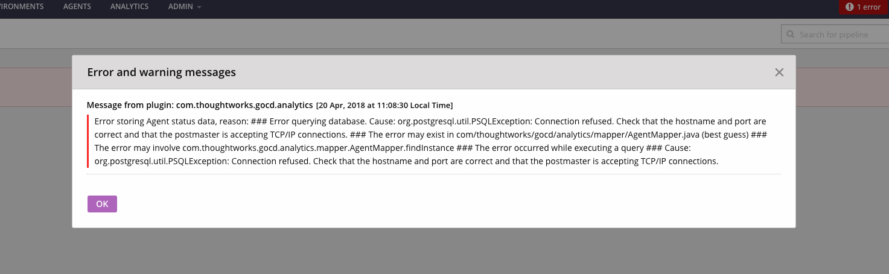
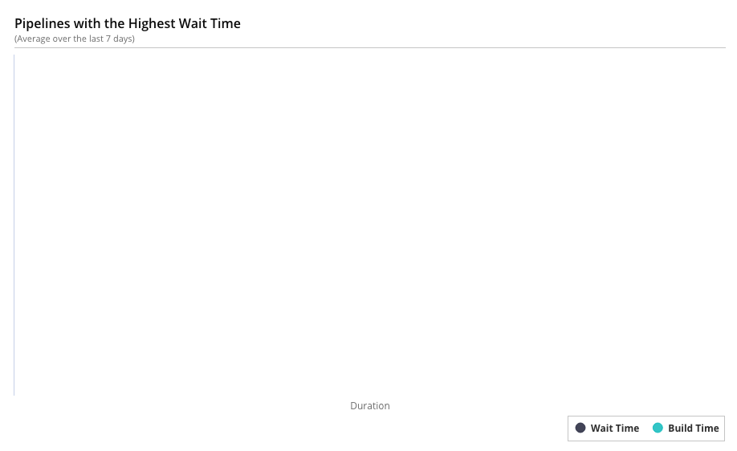

# GoCD Analytics Plugin

# Troubleshooting

## Errors and Warnings:

The plugin notifies GoCD with Error and Warning messages for plugin errors. These messages show up along with GoCD Server's Errors and Warnings.



## Empty Graphs

Once installed and configured, the plugin starts capturing metrics for events such as agent state change or a build trigger. If the graphs are empty, you will have to wait for these events to occur before you can start seeing analytics data.




## Enable Logs

### If you are on GoCD version 19.6 and above:

Edit the file `wrapper-properties.conf` on your GoCD server and add the following options. The location of the `wrapper-properties.conf` can be found in the [installation documentation](https://docs.gocd.org/current/installation/installing_go_server.html) of the GoCD server.

 ```properties
# We recommend that you begin with the index `100` and increment the index for each system property
wrapper.java.additional.100=-Dplugin.com.thoughtworks.gocd.analytics.log.level=debug
```

If you're running with GoCD server 19.6 and above on docker using one of the supported GoCD server images, set the environment variable `GOCD_SERVER_JVM_OPTIONS`:

 ```shell
docker run -e "GOCD_SERVER_JVM_OPTIONS=-Dplugin.com.thoughtworks.gocd.analytics.log.level=debug" ...
```

---

### If you are on GoCD version 19.5 and lower:

* **On Linux:**

    Enabling debug level logging can help you troubleshoot an issue with this plugin. To enable debug level logs, edit the file `/etc/default/go-server` (for Linux) to add:

    ```shell
    export GO_SERVER_SYSTEM_PROPERTIES="$GO_SERVER_SYSTEM_PROPERTIES -Dplugin.com.thoughtworks.gocd.analytics.log.level=debug"
    ```

    If you're running the server via `./server.sh` script:

    ```shell
    $ GO_SERVER_SYSTEM_PROPERTIES="-Dplugin.com.thoughtworks.gocd.analytics.log.level=debug" ./server.sh
    ```

    The logs will be available under `/var/log/go-server`

* **On windows:**

    Edit the file `config/wrapper-properties.conf` inside the GoCD Server installation directory (typically `C:\Program Files\Go Server`):

    ```
    # config/wrapper-properties.conf
    # since the last "wrapper.java.additional" index is 15, we use the next available index.
    wrapper.java.additional.16=-Dplugin.com.thoughtworks.gocd.analytics.log.level=debug
    ```

    The logs will be available under the `logs` folder in the GoCD server installation directory.
