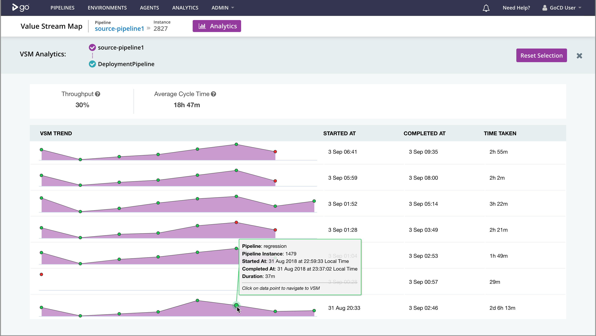
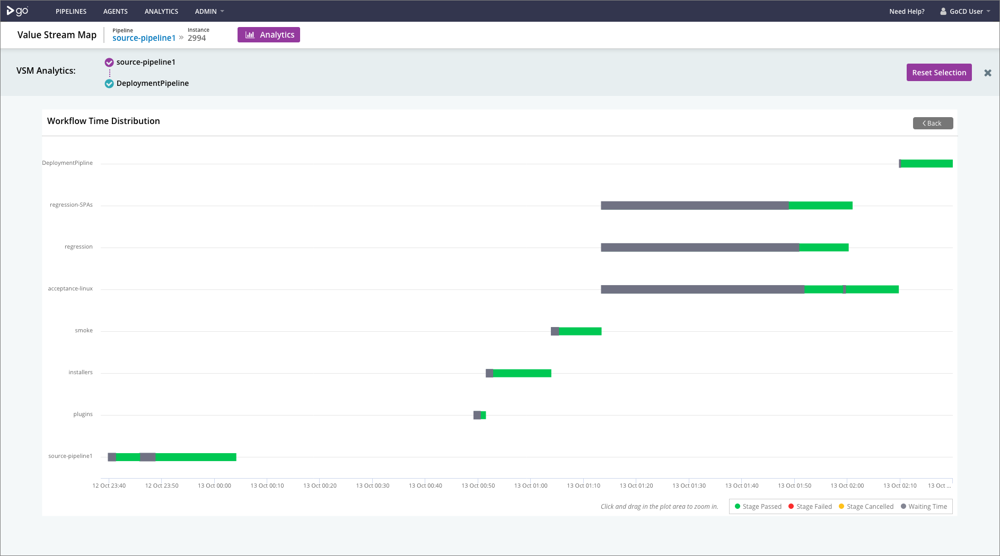
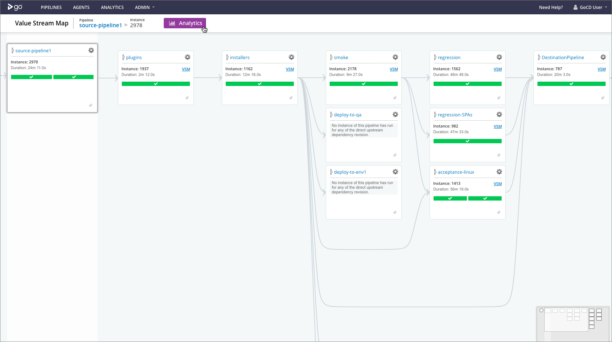
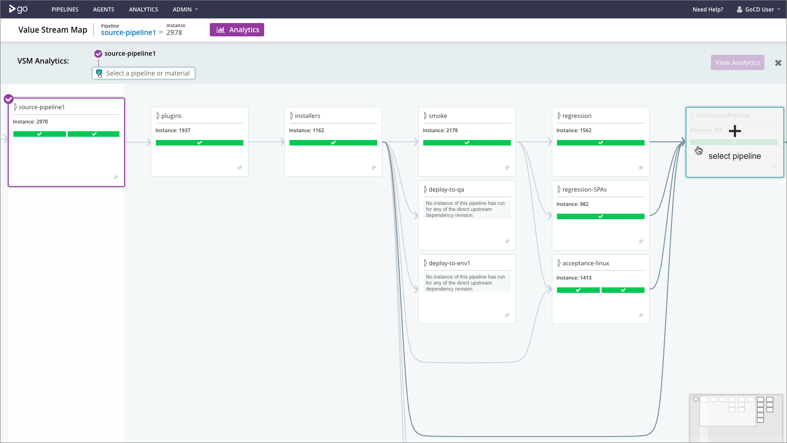
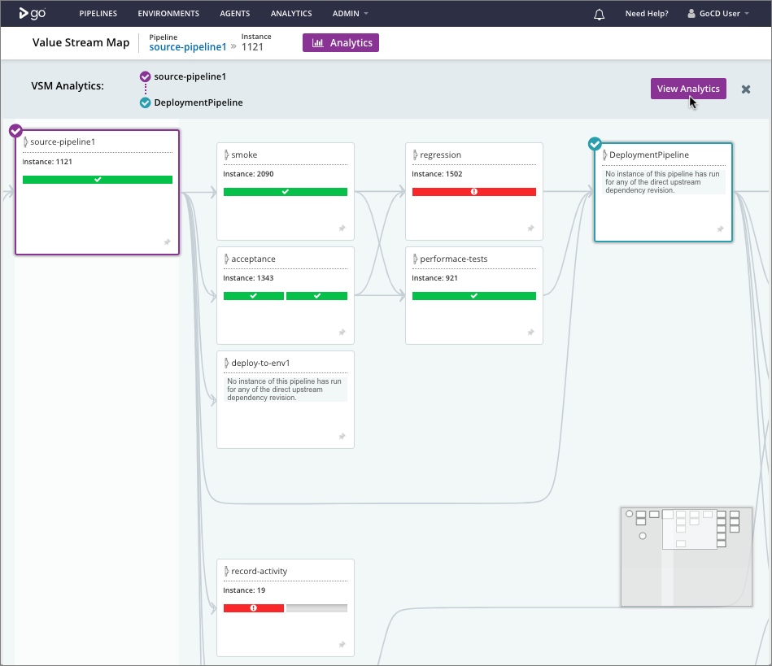
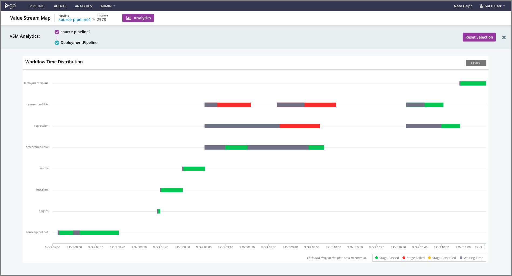

# GoCD Analytics Plugin

## Value Stream Map Analytics

Value Stream Map (VSM) analytics enhances GoCD's powerful VSM feature, by showing metrics across VSM instances, over time. It allows you to see trends across time and provides aggregate metrics such as Deployment Frequency and Average Cycle Time from any two chosen points in a GoCD VSM.

Figure 1: VSM Analytics

The example above shows all the runs of the source pipeline (`source-pipeline1`) on the path to the pipeline named `DeploymentPipeline` and all the pipelines in between in that GoCD Value Stream. There is also an ability to drill down into the specific VSM instance and see more details about the underlying pipeline and stage instances as shown in the below example.

Figure 2: VSM Analytics - Workflow Time Distribution

The above chart provides information about a specific instance of the VSM. It shows details of all the downstream pipelines from source pipeline (`source-pipeline1`) to the destination pipeline `DeploymentPipeline`. The information captured on this chart is at a stage level with information around the stage wait time, build and status of the stage.

# Using the analytics plugin

Start from any GoCD value stream map. Consider the VSM for a pipeline named `source-pipeline1` below:

Figure 3: Pick any GoCD VSM

When you click on the `Analytics` button, you see that `source-pipeline1` is selected and it asks you to choose any other pipeline or material (upstream of `source-pipeline1` or downstream of it).

Figure 4: Select a destination

In this example, upon choosing `DeploymentPipeline`, the `View Analytics` button becomes enabled:

Figure 5: Click “View Analytics”

Upon clicking the `View Analytics` button, you see the Value Stream Map analytics:

Figure 6: See VSM Analytics trend lines

To get details of all the pipelines in a specific run, click the `More Info` button:

Figure 7: VSM Analytics - Workflow Time Distribution

The Workflow Time Distribution chart helps visualize all the pipelines run between the `source-pipeline1` and the `DeploymentPipeline`. The chart represents the data at a stage level with information about the Stage wait time and total build time.

The Workflow Time Distribution chart also captures any re-run of pipeline stages from the `source-pipeline` and the `DeploymentPipeline` as shown in the below example.

Figure 8: VSM Analytics - Workflow Time Distribution with re-runs

You can now choose the `Reset Selection` button to see the VSM analytics for another pipeline, starting from `source-pipeline1` or click on the close button (`X`) to exit the VSM analytics mode.

# Understanding the VSM analytics chart

## Trends

Each cell in the "VSM Trend" column shows you a "linearized" path from the chosen source (material or pipeline) to the chosen destination pipeline. Consider a Value Stream such as the one in the illustration below:

Figure 9: Example with 4 pipelines with fan-out and fan-in

When converted to a trend line in the "VSM Trend" column, it becomes:

Figure 10: Linearized trend line for VSM in Figure 9

The first green dot will be guaranteed to be "pipeline1" and the last green dot will be guaranteed to be "pipeline4". However, since there is a fan-out and fan-in in between, the second and third dots will be "pipeline2" and "pipeline3" in that order (top to bottom for each column in GoCD's VSM).

**Note**: An important aspect to note is that only the pipelines in the path from the source to the destination are shown. In "Figure 6" above, the dots correspond to the pipelines named `source-pipeline1`, `smoke`, `acceptance`, `regression`, `performance-tests` and `DeploymentPipeline` in "Figure 5". The pipelines which are not part of the trend lines are: `deploy-to-env1` and `record-activity`, since they're not in the path from `source-pipeline1` to `DeploymentPipeline`.

## Comparing across trend lines

Trend lines **cannot** be used to compare times *across VSM instances* by visual inspection. To understand this, consider the VSM trend lines below, focusing on the 4th and 5th rows:

Figure 11: Trend lines

The maximum heights of the trend lines are the same. However, looking at the tooltips, it is clear that one of the instances took over 11 hours, while the other took less than an hour. The heights of the components of the trend lines can be compared within a trend line, but not across them.

Figure 12: Not possible to compare across trend lines visually

## Navigating to the GoCD VSM

You can click on any of the dots in a VSM trend line to take you to the Value Stream Map page of the corresponding pipeline instance.

## Deployment Frequency

Deployment Frequency is a measure of the rate of reaching the destination pipeline. It is expressed as a percentage. In the VSM trends chart shown below, the Deployment Frequency is 30% because only 3 out of 10 runs reached the destination pipeline. **Note** that the failure of the destination pipeline did not affect the throughput value.

Figure 13: Showing throughput

## Average Cycle Time

Cycle time is a measure of how long it takes from source to the next **successful** destination pipeline run. It is a unit of time. The "Average Cycle Time" metrics is an average across multiple cycles, as described below.

Figure 14: Calculating average cycle time

In the example above, there are two "cycles" according to this definition. There is one which starts at time T1 (9AM) and finishes successfully at time T2 (11AM) for a cycle time of 2 hours. The next cycle starts at time T3 (12PM) and fails a couple of times before finishing successfully at time T4 (4PM) for a cycle time of 4 hours. The average cycle time is then an average of 2 hours and 4 hours, which comes up to 3 hours.

# Different scenarios with trend lines

## Scenario 1: Why did it stop when successful?

Consider the case in the image below. Why did those two VSMs stop, when everything was successful?

Figure 15: Why did those VSM runs stop?

One reason could be that those pipelines have _just finished_ and their downstream pipelines have not started yet. This can only be true for very recent pipelines.

A more plausible reason is that a sibling pipeline has failed. Consider a GoCD VSM instance like the one below:

Figure 16: Sibling has failed

In this case, if the **source pipeline** is `pipeline2` and the destination is `pipeline4`, then in the path from the source to the destination, `pipeline3` does not appear. So, it does not show in the trend lines. However, since `pipeline4` never ran, the trend line does not continue, even though `pipeline2` has finished successfully.

## Scenario 2: Why did it go ahead even when not successful?

Consider the case in the image below. Why did those two VSMs not stop, when something failed?

Figure 17: Why did those VSM runs continue?

There could be a few reasons:

### Reason 1: Siblings and "Linearization"

 has succeeded')

Figure 18: Sibling (in path) has succeeded

In this case, if the **source pipeline** is `pipeline1` and the destination is `pipeline4`, then in the path from the source to the destination, `pipeline3` does appear. Since it is below `pipeline2` in the VSM, it will be after `pipeline2`, when converted to a linear trend line. Since `pipeline2` failed and `pipeline3` succeeded, the trend line looks like the one shown in Figure 17.

### Reason 2: Force trigger (manual)

It's possible that pipelines are forcibly triggered, manually. This can make the pipelines end up in any state, causing a confusing VSM. You'll usually see the term "X more..." in the VSM if that is the case.

Figure 19: Possibly manual triggered

## Scenario 3: It says some pipelines in a VSM have not run

Consider the case in the image below. Why are those pipelines colored black and how are there pipelines which have run after them?

Figure 20: Why did those VSM runs continue?

There could be a few reasons:

### Reason 1: Siblings and "Linearization"

 has succeeded')

Figure 21: Sibling (in path) has succeeded

In this case, if the **source pipeline** is `pipeline1` and the destination is `pipeline6`. The order, when converted to a linear trend line, will be `pipeline1`, `pipeline2`, `pipeline3`, `pipeline4`, `pipeline5` and `pipeline6`. Since `pipeline2` failed, `pipeline4` did not run. The trend line looks like the one shown in Figure 20.

### Reason 2: Force trigger (manual)

Just as in the previous scenario, it's possible that pipelines are forcibly triggered, manually. This can make the pipelines end up in any state, causing a confusing VSM. You'll usually see the term "X more..." in the VSM if that is the case.
